# Weather Map

-  Created a Python script to visualize the weather of 602 cities across the world of varying distance from the equator using the OpenWeatherMap API

-  Created a series of scatter plots to showcase the following relationships

    - Temperature (F) vs. Latitude
    
    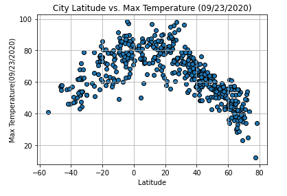

    - Humidity (%) vs. Latitude
    
    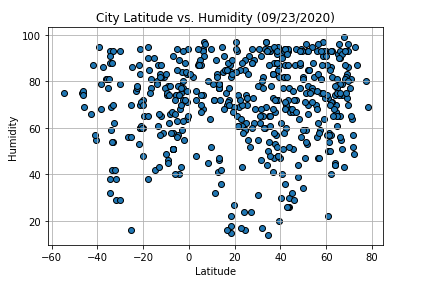

    - Cloudiness (%) vs. Latitude
    
    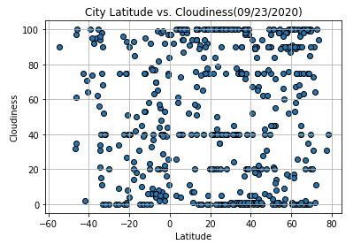

    - Wind Speed (mph) vs. Latitude

    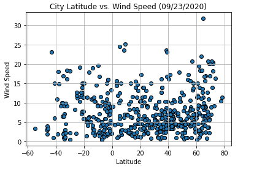

- Ran linear regression on each relationship and separated them into Northern Hemisphere and Southern Hemisphere 
    
    - Northern Hemisphere - Temperature (F) vs. Latitude

    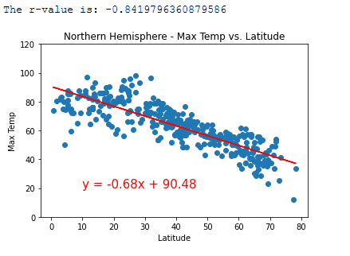

    - Southern Hemisphere - Temperature (F) vs. Latitude

    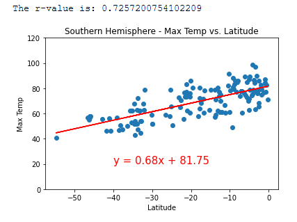

    - Northern Hemisphere - Humidity (%) vs. Latitude

    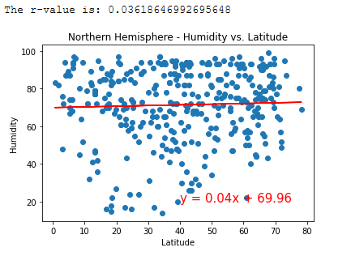

    - Southern Hemisphere - Humidity (%) vs. Latitude

    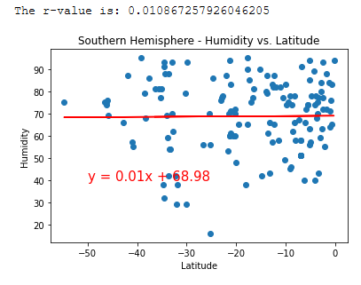

    - Northern Hemisphere - Cloudiness (%) vs. Latitude

    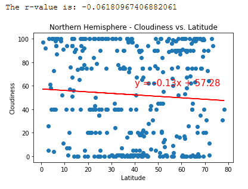

    - Southern Hemisphere - Cloudiness (%) vs. Latitude

    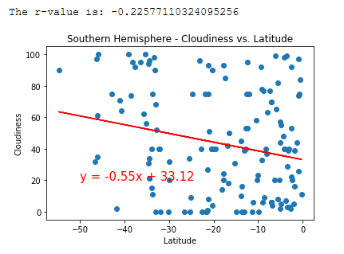

    - Northern Hemisphere - Wind Speed (mph) vs. Latitude

    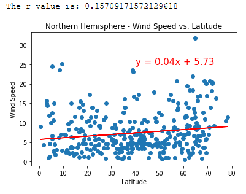

    - Southern Hemisphere - Wind Speed (mph) vs. Latitude

    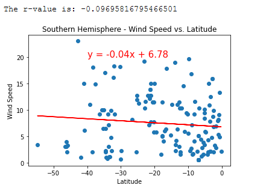

- Created a heat map that displays the humidity for every city and plotted hotel on top of heat map

